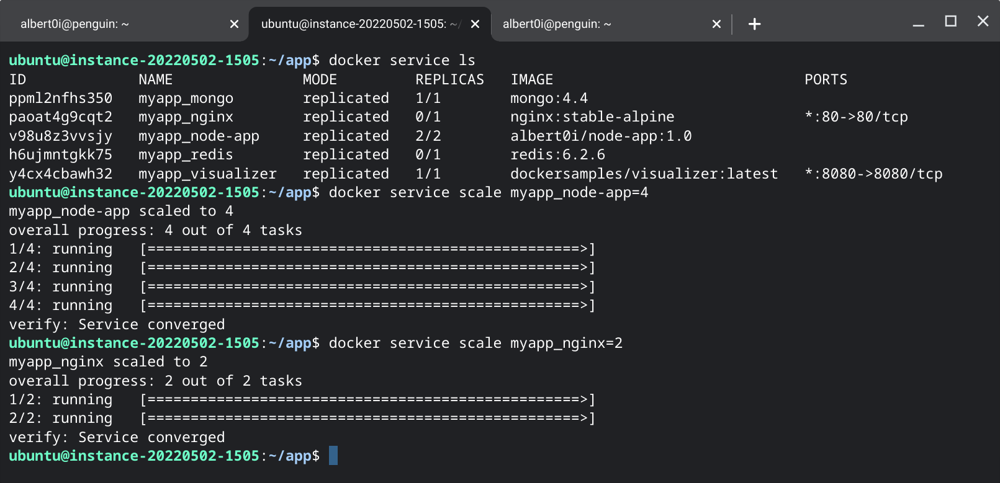

# [Notes from Underground](https://www.gutenberg.org/files/600/600-h/600-h.htm)


## I. Introduction
<span style="color:white;background:black;font-size:36px;bold:true">IT</span> is bizarre not to consider moving your websites to [Docker](https://www.docker.com/products/docker-desktop/) environment in 2022. While reducing hardware and software cost is one gain, another gain is [*scalability*](https://en.wikipedia.org/wiki/Scalability); the pain is to learn a new set of CLI Commands and  write `Dockerfile`,  `docker-compose.yml` and *optionally* `Makefile`. It's always easy to get started but difficult to become an expert. The only way is by step by step learning and applying it to more and more projects, there is no quick way to success. 


## II. Architecture
 When one starts to create a website, it is not uncommon to confront with multiple environments, ie: development, staging and production... [Rule of three](https://en.wikipedia.org/wiki/Rule_of_three_(computer_programming)) states that two instances of similar code do not require refactoring, but when similar code is used three times, it should be extracted into a new procedure. 
 
 Using multiple docker-compose.yml files enables you to customize a application for different environments or different workflows<sup>[[2]](https://docs.docker.com/compose/extends/)</sup>: 
 
 > By default, Compose reads two files, a docker-compose.yml and an optional docker-compose.override.yml file. By convention, the docker-compose.yml contains your base configuration. The override file, as its name implies, can contain configuration overrides for existing services or entirely new services.
 
 > f a service is defined in both files, Compose merges the configurations using the rules described in Adding and overriding configuration.

 > To use multiple override files, or an override file with a different name, you can use the -f option to specify the list of files. Compose merges files in the order they’re specified on the command line. See the docker-compose command reference for more information about using -f.

### docker-compose.yml 
```yml
version: "3"
services:
  nginx:
    image: nginx:stable-alpine
    volumes:
      - ./nginx/default.conf:/etc/nginx/conf.d/default.conf
      - ./ssl:/etc/nginx/ssl
    depends_on:
    - node-app

  node-app:
    image: albert0i/node-app:1.1
    environment:
      - PORT=3000
    depends_on:
      - mongo
      - redis

  mongo:
    image: mongo:4.4
    environment:
      - MONGO_INITDB_ROOT_USERNAME=root
      - MONGO_INITDB_ROOT_PASSWORD=root
    volumes:
      - ./data/db:/data/db
  
  redis:
    image: redis:6.2.6
```

### docker-compose.dev.yml
```yml
version: "3"
services:
  nginx:
    ports:
      - "3000:80"
      - "3443:443"

  node-app:
    build:
      context: . 
      args: 
        NODE_ENV: development
    volumes:
      - ./:/app
      - /app/node_modules
    environment:
      - NODE_ENV=development
      - MONGO_USER=root
      - MONGO_PASSWORD=root
      - SESSION_SECRET=secret
    command: npm run dev 
``` 

### docker-compose.prod.yml
```yml
version: "3"
services:
  nginx:
    ports:
      - "80:80"
      - "443:443"

  node-app:

    deploy:
      replicas: 2
      restart_policy:
        condition: any
      update_config:
        parallelism: 1
        delay: 15s

    build:
      context: . 
      args: 
        NODE_ENV: production

    environment:
      - NODE_ENV=production
      - MONGO_USER=${MONGO_USER}
      - MONGO_PASSWORD=${MONGO_PASSWORD}
      - SESSION_SECRET=${SESSION_SECRET}
    command: npm run start 

  mongo:
      environment:
      - MONGO_INITDB_ROOT_USERNAME=${MONGO_INITDB_ROOT_USERNAME}
      - MONGO_INITDB_ROOT_PASSWORD=${MONGO_INITDB_ROOT_PASSWORD}
      deploy:
        replicas: 1
        placement:
            constraints: [node.role == manager]

  visualizer:
      image: dockersamples/visualizer
      volumes:
        - "/var/run/docker.sock:/var/run/docker.sock"
      ports:
        - "8080:8080"
      deploy:
        replicas: 1
        placement:
            constraints: [node.role == manager]
```

### Dockerfile
```yml
FROM node:16.8.0-alpine
WORKDIR /app
COPY package.json .
#RUN npm install
ARG NODE_ENV
RUN if [ "$NODE_ENV" = "development" ];     \
        then npm install;                   \
        else npm install --only=production; \
    fi
COPY . .
ENV PORT 3000
EXPOSE $PORT 
CMD ["npm", "run", "dev"]
```

### .env 
```bash
#
# Attention: No space before the equal sign! Otherwise, will show: 
# "docker: poorly formatted environment: variable 'XXX ' contains whitespaces."
#
PORT=3000
```

```bash
# Development
docker-compose -f docker-compose.yml -f docker-compose.dev.yml [options] [COMMAND] [ARGS...]

# Production
docker-compose -f docker-compose.yml -f docker-compose.dev.yml [options] [COMMAND] [ARGS...]
```


## III. Development environment

```bash
# Create and start containers
docker-compose -f docker-compose.yml -f docker-compose.dev.yml up -d 

# Create and start containers. 
# Build images before starting containers
# Recreate anonymous volumes instead of retrieving data from the previous containers.
docker-compose -f docker-compose.yml -f docker-compose.dev.yml up -d --build -V

# Scale SERVICE to NUM instances. Overrides the "scale" setting in the Compose file if present.
docker-compose -f docker-compose.yml -f docker-compose.dev.yml up -d --scale node-app=2

# Validate and view the Compose file
docker-compose -f docker-compose.yml -f docker-compose.dev.yml config

# Start service "node-app". Do not start linked services.
docker-compose -f docker-compose.yml -f docker-compose.dev.yml up -d --no-deps node-app

# Start servcie "mongo"
docker-compose -f docker-compose.yml -f docker-compose.dev.yml up -d mongo

# View output from containers
docker-compose logs node-app 

# Execute a command in a running container 
docker-compose exec node-app printenv

# Execute a command in a running container 
docker-compose exec mongo mongo -u root -p root 
...
    db.books.insert({"name": "Harry Potter"});
...

# Stop and remove containers, networks, images, and volumes
# Remove named volumes declared in the "volumes" section of the Compose file and 
# anonymous volumes attached to containers.
docker-compose -f docker-compose.yml -f docker-compose.dev.yml down -v
```


## IV. Production environment (Standalone mode) 

```bash
# Create and start containers
docker-compose -f docker-compose.yml -f docker-compose.prod.yml up -d 

# Create and start containers. 
# Build images before starting containers
docker-compose -f docker-compose.yml -f docker-compose.prod.yml up -d --build

# Create and start containers. 
# Build images before starting containers
# Start service "node-app". Do not start linked services.
docker-compose -f docker-compose.yml -f docker-compose.prod.yml up -d --build --no-deps node-app

# Create and start containers
# Show more output
docker-compose --verbose -f docker-compose.yml -f docker-compose.prod.yml up -d
 
# Create and start containers
# Show more output. Set log level (DEBUG, INFO, WARNING, ERROR, CRITICAL)
docker-compose --verbose --log-level=DEBUG -f docker-compose.yml -f docker-compose.prod.yml up -d

# Stop and remove containers, networks, images, and volumes
docker-compose -f docker-compose.yml -f docker-compose.prod.yml down -v
```


## V. Production environment (Docker mode) 

### Links online
&emsp;[http](http://132.145.115.172/api/v1)

&emsp;[https](https://132.145.115.172:443/api/v1)

&emsp;[visualizer](http://132.145.115.172:8080)

###  Node
```bash
cd myapp 

# List nodes in the swarm
docker node ls
```

### Stack 
```bash
# Deploy a new stack or update an existing stack
docker stack deploy -c docker-compose.yml -c docker-compose.prod.yml myapp

# List stacks
docker stack ls 

# List the tasks in the stack
docker stack ps myapp

# List the services in the stack
docker stack services myapp

# Remove one or more stacks
docker stack rm myapp
```

### Service
```bash
# List services
docker service ls

# List the tasks of one or more services
docker service ps myapp_node-app

# Fetch the logs of a service or task
docker service logs mmyapp_node-app

# Scale one or multiple replicated services
docker service scale myapp_node-app=4
docker service scale myapp_nginx=2
```


```console
```


## VI. Conclusion


## VII. Reference
1. [Learn Docker - DevOps with Node.js & Express](https://www.youtube.com/watch?v=9zUHg7xjIqQ&t=356s)
2. [Share Compose configurations between files and projects](https://docs.docker.com/compose/extends/)
3. [How to generate and use a SSL certificate in NodeJS](https://www.youtube.com/watch?v=USrMdBF0zcg&t=5s) 
4. [Quick Tip: Configuring NGINX and SSL with Node.js](https://www.sitepoint.com/configuring-nginx-ssl-node-js/?fbclid=IwAR0JfD6HPoaDWGWPXnOiub5tVXqGVPHVstGxkBo56vm8up-4HzZteEfOVxs) 
5. [How to Use SSL/TLS with Node.js](https://www.sitepoint.com/how-to-use-ssltls-with-node-js/?fbclid=IwAR3t0OI5X6IyeVfxo_AZKX2yeqPGzRbEG8aPm9BHEdsTh1f2IJoz12ea5GU)
6. [[v1.25.0] "Only pull images that can't be built" should be optional #7103](https://github.com/docker/compose/issues/7103) 
7. [Markdown Cheat Sheet](https://www.markdownguide.org/cheat-sheet/) 


## VIII. Appendix 

Configuring NGINX by adding three more lines to server block in default.conf: 

```nginx 
    listen 443 ssl;

    ssl_certificate  /etc/nginx/ssl/cert.pem;
    ssl_certificate_key /etc/nginx/ssl/key.pem;
```

### default.conf

```nginx
server {
    listen 80;
    listen 443 ssl;

    ssl_certificate  /etc/nginx/ssl/cert.pem;
    ssl_certificate_key /etc/nginx/ssl/key.pem;

    location /api {
        proxy_set_header X-Real-IP $remote_addr;
        proxy_set_header X-Forwarded-For $proxy_add_x_forwarded_for;

        proxy_set_header Host $http_host;
        proxy_set_header X-NginX-Proxy true;
        proxy_pass http://node-app:3000;
        proxy_redirect off;

    }
}
```


## EOF (2022/06/24)

<!--
#
# [v1.25.0] "Only pull images that can't be built" should be optional #7103
# https://github.com/docker/compose/issues/7103
# 
# It seems to be due to the Only pull images that can't be built feature of v1.25.0 (v1.24.1 doesn't have this issue).
# yep, confirmed. 1.25.1-rc1 solves the issue. Waiting for stable release 
#
# So, if you want to use docker-compose pull node-app in production environment, 
# be sure to COMMENT OUT line 17~20.
# 
# EOF (2022/05/08)
#
-->


