# Docker swarm on Oracle Cloud (Free Tier)<br /> ─ 窮L的後現代生活

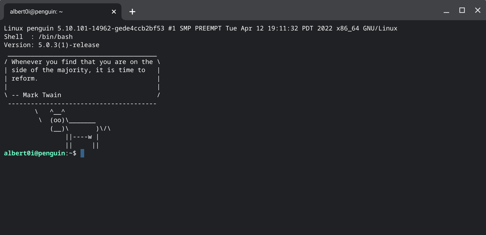

## I. Oracle Cloud Infrastructure (OCI)
Oracle Cloud Free Tier allows you to explore a wide range of Oracle Cloud Infrastructure products and a set of Always Free offers. Regarding to the number of compute instances available to Oracle Free Tier account. Following are excerpts from [[1]](https://docs.oracle.com/en-us/iaas/Content/FreeTier/freetier_topic-Always_Free_Resources.htm). 

>Depending on the size of the boot volume and the number of OCPUs that you allocate to each Ampere A1 Compute instance, you can create up to four compute instances. The minimum boot volume size for each instance is 47 GB, regardless of shape. Your account comes with 200 GB of Always Free block volume storage which you use to create the boot volumes for your compute instances.

>For example, using the default boot volume size of 47 GB, you could provision two instances using the VM.Standard.E2.1.Micro shape, and two Ampere A1 Compute instances that each have 2 OCPUs. Or, you could provision four Ampere A1 Compute instances with 1 OCPU each, and zero instances using the VM.Standard.E2.1.Micro shape. Many combinations are possible, depending on how you allocate your block storage and Ampere A1 Compute OCPUs. See [Details of the Always Free compute instances](https://docs.oracle.com/en-us/iaas/Content/FreeTier/freetier_topic-Always_Free_Resources.htm#Details_of_the_Always_Free_Compute_instance__a1_flex) for more information on allocating OCPU and memory resources when creating Ampere A1 Compute instances.

For Virtual Cloud Networks (VCNs): 
>Free Tier tenancies (tenancies that are not paid and do not have Free Trial credits) can have up to 2 virtual cloud networks (VCNs). A VCN is a software-defined network that you set up in the Oracle Cloud Infrastructure data centers in a particular region. VCNs include IPv4 and IPv6 support.

In a word,  
- Two **Micro instances (AMD processor)** [Always Free] VM instances using the VM.Standard.E2.1.Micro shape; with AMD EPYC（霄龍）7551 2GHz dual CPU, 1GB memory and 47GB hard disk each;  

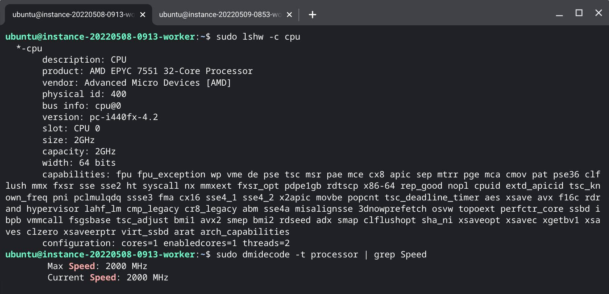

- Two **Ampere A1 Compute instances (Arm processor)** VM instances using the VM.Standard.A1.Flex shape; with Neoverse-N1 2GHz single CPU, 6GB memory and 47GB hard disk each;  

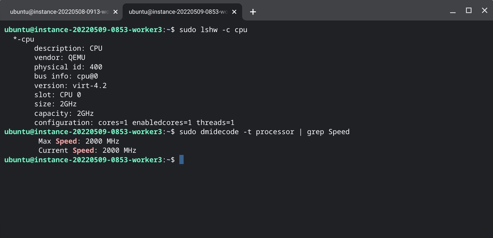

in favour of more powerful CPUs. 


## II. Docker swarm ingress network
Docker swarm makes use a special overlay network **ingress** to facilitate load balancing among a service’s nodes. The ingress network is created automatically when you initialize or join a swarm. Most users do not need to customize its configuration, but Docker allows you to do so.[[2]](https://docs.docker.com/engine/swarm/networking/)

By default, ingress network resides in "10.0.0.0/24" which collides with default Virtual Cloud Networks (VCN), therefore the ingress network doesn’t appear to be working properly! [[3]](https://www.reddit.com/r/docker/comments/n0djds/docker_swarm_on_oracle_always_free_tier_nodes_no) 

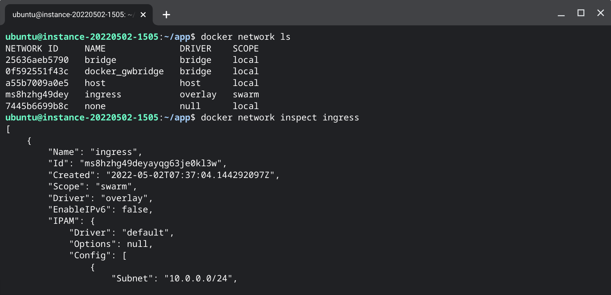

In addition, all traffic between clients is blocked by default in Oracle cloud. The solution is to add rules for your subnet to the security list of the VCN the VMs are connected to. [[4]](https://stackoverflow.com/questions/65115349/unable-to-join-docker-swarm-using-oracle-cloud-vms-connected-to-the-same-vcn)


## III. Virtual Cloud Networks (VCN)
Free Tier tenancies can have up to 2 virtual cloud networks (VCNs). 
- Open Oracle Cloud Menu by clicking the left upper <font size=32>≡</font>
- Choose Networking → Virtual Cloud Networks → Create VCN
- Give it a name **vcn-20220502-2201** for example, the subnet can be "10.10.1.0/24" or something else

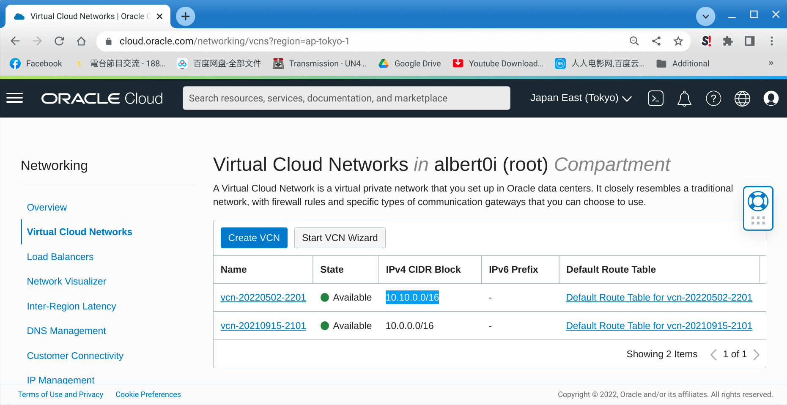

---
- On the public subnet created, click to edit the **Default Security List**
- Add **Ingress Rules** for port 80, 8080, 3000, 8000, and 443 etc
- Add two more **Ingress Rules** for subnet "10.10.0.0/16' TCP and UDP traffics

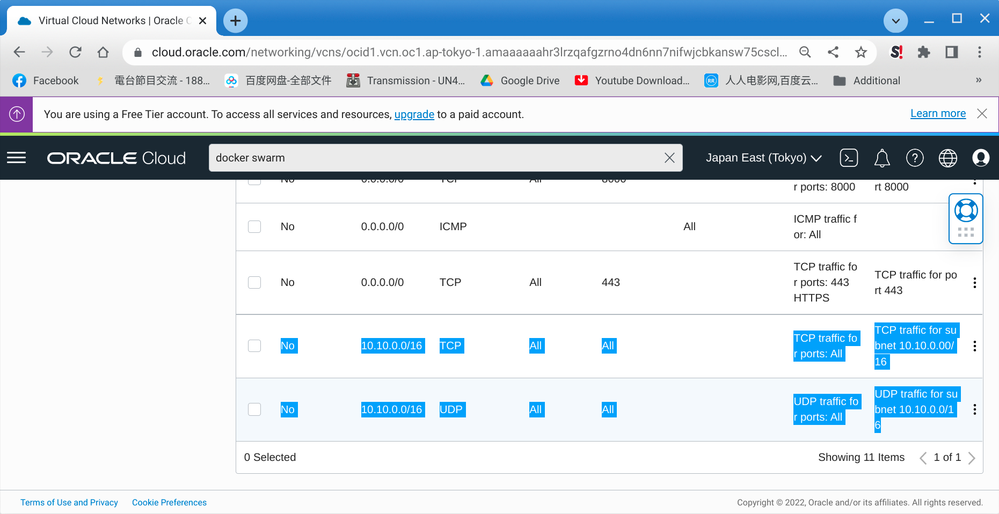

---
- Once created, subsequent creation of instances will use this customized network
- OCI instances can't attach more than one networks
- You can choose network settings ONLY in instance creation
- OCI instance can't change network settings

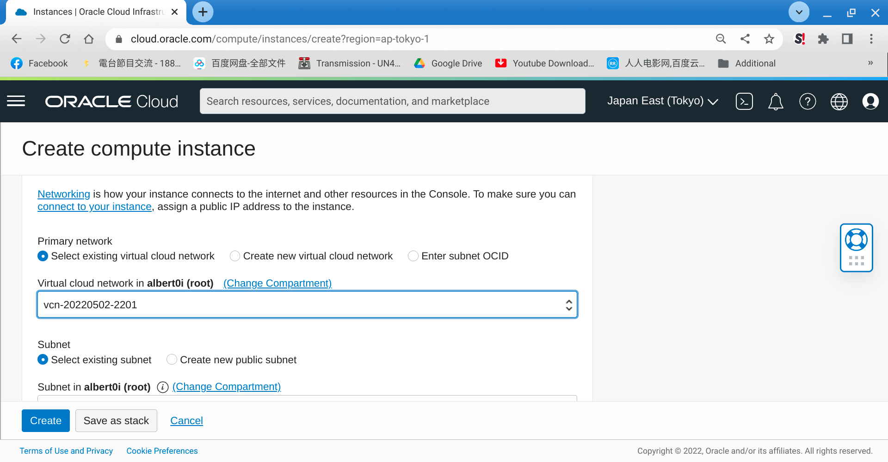

## IV. OCI Instances  

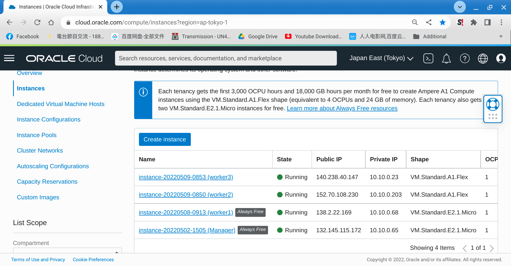


## V. Scripts

### .profile
```console
#
# Add to the end
# some more ls aliases
alias ll='ls -l'
alias la='ls -A'
#alias l='ls -CF'
alias ver='uname -a;echo "Shell  :" $SHELL; echo "Version:" $BASH_VERSION'
alias cls='clear'

# some more environment variables
export PATH=$PATH:.
set -o allexport;source /home/ubuntu/.env;set +o allexport

# replace accordingly
echo '███╗░░░███╗░█████╗░███╗░░██╗░█████╗░░██████╗░███████╗██████╗░'
echo '████╗░████║██╔══██╗████╗░██║██╔══██╗██╔════╝░██╔════╝██╔══██╗'
echo '██╔████╔██║███████║██╔██╗██║███████║██║░░██╗░█████╗░░██████╔╝'
echo '██║╚██╔╝██║██╔══██║██║╚████║██╔══██║██║░░╚██╗██╔══╝░░██╔══██╗'
echo '██║░╚═╝░██║██║░░██║██║░╚███║██║░░██║╚██████╔╝███████╗██║░░██║'
echo '╚═╝░░░░░╚═╝╚═╝░░╚═╝╚═╝░░╚══╝╚═╝░░╚═╝░╚═════╝░╚══════╝╚═╝░░╚═╝'
ver
```
### .env
```console
NODE_ENV=production

MONGO_USER=root

MONGO_PASSWORD=root

SESSION_SECRET=secret

MONGO_INITDB_ROOT_USERNAME=root

MONGO_INITDB_ROOT_PASSWORD=root

PUBLIC_IP=132.145.115.172 #replace accordingly

INT_NAME="ens3" #replace accordingly
PRIVATE_IP=$(ip addr show $INT_NAME | grep "inet\b" | awk '{print $2}' | cut -d/ -f1)
```
### .bash_logout
```console
## Add to the end
echo 
echo Goodbye $(whoami), have a nice day!
sleep 1
clear
```
### install packages
```console
sudo apt-get update -y
sudo apt install docker.io -y
sudo apt install docker-compose -y
sudo apt install fortune-mod -y
sudo apt install cowsay -y
sudo apt install mc -y
```
### disable ufw and iptables
```console
sudo systemctl status ufw
sudo systemctl disable ufw
sudo systemctl stop ufw
sudo systemctl status ufw

sudo systemctl status iptables
sudo systemctl disable iptables
sudo systemctl stop iptables
sudo systemctl status iptables
```
### configure docker
```console
sudo chmod 666 /var/run/docker.sock
sudo usermod -aG docker ${USER}
```
### configure docker swarm
```console
docker swarm init --advertise-addr 10.10.0.65

To add a worker to this swarm, run the following command:

    docker swarm join --token SWMTKN-1-0t7xb0wo9ttl75ofimvlikhgprmqtvz8f8yfyarub5b0que9g3-bgl7zox94yqhwpogb2eln5e4d 10.10.0.65:2377

To add a manager to this swarm, run the following command:

    docker swarm join --token SWMTKN-1-0t7xb0wo9ttl75ofimvlikhgprmqtvz8f8yfyarub5b0que9g3-782k5kk40a2itv8fmbrxxmorn 10.10.0.65:2377
```
## VI. Deployment

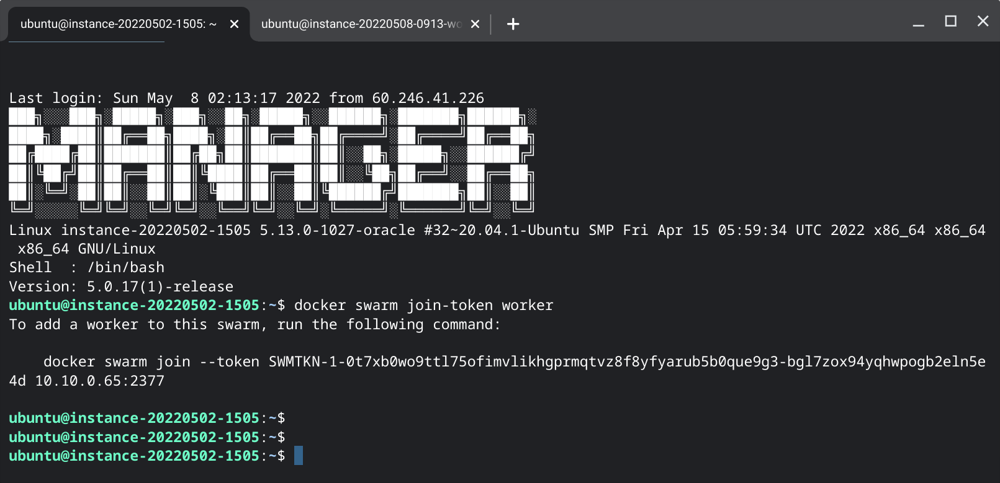
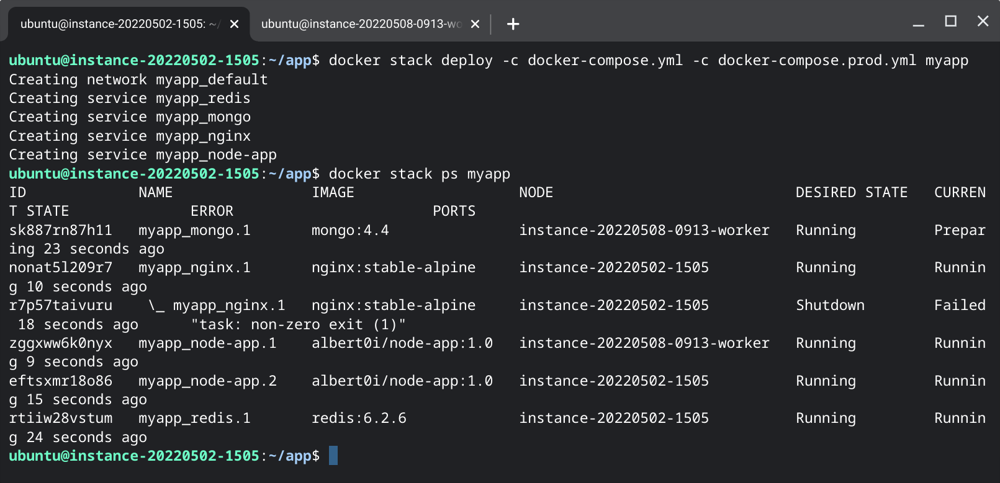

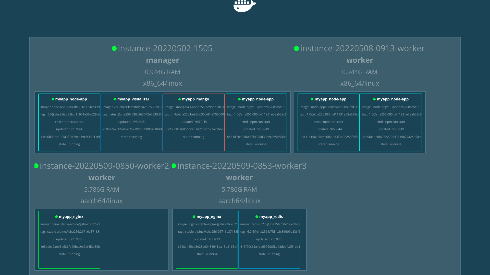


## VII. Reference
1. [Oracle Cloud's Free Tier|Always Free Resources](https://docs.oracle.com/en-us/iaas/Content/FreeTier/freetier_topic-Always_Free_Resources.htm)
2. [Manage swarm service networks](https://docs.docker.com/engine/swarm/networking/)
3. [Docker Swarm on Oracle always free tier nodes: no route to host](https://www.reddit.com/r/docker/comments/n0djds/docker_swarm_on_oracle_always_free_tier_nodes_no/)
4. [Unable to join docker swarm using Oracle Cloud VMs connected to the same VCN](https://stackoverflow.com/questions/65115349/unable-to-join-docker-swarm-using-oracle-cloud-vms-connected-to-the-same-vcn)
5. [Got permission denied while trying to connect to the Docker daemon socket at unix:///var/run/docker.sock: Get http://%2Fvar%2Frun%2Fdocker.sock/v1.24/images/json?all=1: dial unix /var/run/docker.sock: connect: permission denied code example](https://shouland.com/shell-got-permission-denied-while-trying-to-connect-to-the-docker-daemon-socket-at-unix-var-run-docker-sock-get-http-2fvar-2frun-2fdocker-sock-v1-24-images-json-all-1-dial-unix-var-run-docker-sock-connect-permission-denied-code-example)
6. [dockersamples/docker-swarm-visualizer](https://github.com/dockersamples/docker-swarm-visualizer)
7. [Text Art](https://fsymbols.com/text-art/)


## VII. Text Art 
```console
echo '███╗░░░███╗░█████╗░███╗░░██╗░█████╗░░██████╗░███████╗██████╗░'
echo '████╗░████║██╔══██╗████╗░██║██╔══██╗██╔════╝░██╔════╝██╔══██╗'
echo '██╔████╔██║███████║██╔██╗██║███████║██║░░██╗░█████╗░░██████╔╝'
echo '██║╚██╔╝██║██╔══██║██║╚████║██╔══██║██║░░╚██╗██╔══╝░░██╔══██╗'
echo '██║░╚═╝░██║██║░░██║██║░╚███║██║░░██║╚██████╔╝███████╗██║░░██║'
echo '╚═╝░░░░░╚═╝╚═╝░░╚═╝╚═╝░░╚══╝╚═╝░░╚═╝░╚═════╝░╚══════╝╚═╝░░╚═╝'
```
```console
echo '░██╗░░░░░░░██╗░█████╗░██████╗░██╗░░██╗███████╗██████╗░░░███╗░░'
echo '░██║░░██╗░░██║██╔══██╗██╔══██╗██║░██╔╝██╔════╝██╔══██╗░████║░░'
echo '░╚██╗████╗██╔╝██║░░██║██████╔╝█████═╝░█████╗░░██████╔╝██╔██║░░'
echo '░░████╔═████║░██║░░██║██╔══██╗██╔═██╗░██╔══╝░░██╔══██╗╚═╝██║░░'
echo '░░╚██╔╝░╚██╔╝░╚█████╔╝██║░░██║██║░╚██╗███████╗██║░░██║███████╗'
echo '░░░╚═╝░░░╚═╝░░░╚════╝░╚═╝░░╚═╝╚═╝░░╚═╝╚══════╝╚═╝░░╚═╝╚══════╝'
```
```console
echo '░██╗░░░░░░░██╗░█████╗░██████╗░██╗░░██╗███████╗██████╗░██████╗░'
echo '░██║░░██╗░░██║██╔══██╗██╔══██╗██║░██╔╝██╔════╝██╔══██╗╚════██╗'
echo '░╚██╗████╗██╔╝██║░░██║██████╔╝█████═╝░█████╗░░██████╔╝░░███╔═╝'
echo '░░████╔═████║░██║░░██║██╔══██╗██╔═██╗░██╔══╝░░██╔══██╗██╔══╝░░'
echo '░░╚██╔╝░╚██╔╝░╚█████╔╝██║░░██║██║░╚██╗███████╗██║░░██║███████╗'
echo '░░░╚═╝░░░╚═╝░░░╚════╝░╚═╝░░╚═╝╚═╝░░╚═╝╚══════╝╚═╝░░╚═╝╚══════╝'
```
```console
echo '░██╗░░░░░░░██╗░█████╗░██████╗░██╗░░██╗███████╗██████╗░██████╗░'
echo '░██║░░██╗░░██║██╔══██╗██╔══██╗██║░██╔╝██╔════╝██╔══██╗╚════██╗'
echo '░╚██╗████╗██╔╝██║░░██║██████╔╝█████═╝░█████╗░░██████╔╝░█████╔╝'
echo '░░████╔═████║░██║░░██║██╔══██╗██╔═██╗░██╔══╝░░██╔══██╗░╚═══██╗'
echo '░░╚██╔╝░╚██╔╝░╚█████╔╝██║░░██║██║░╚██╗███████╗██║░░██║██████╔╝'
echo '░░░╚═╝░░░╚═╝░░░╚════╝░╚═╝░░╚═╝╚═╝░░╚═╝╚══════╝╚═╝░░╚═╝╚═════╝░'
```

## EOF (2022/05/21)
